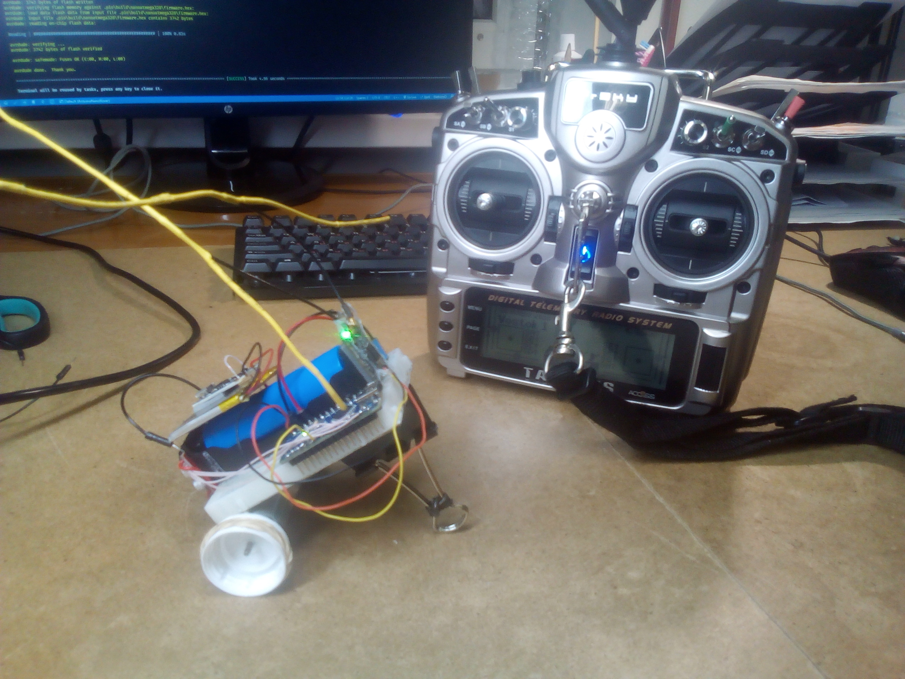
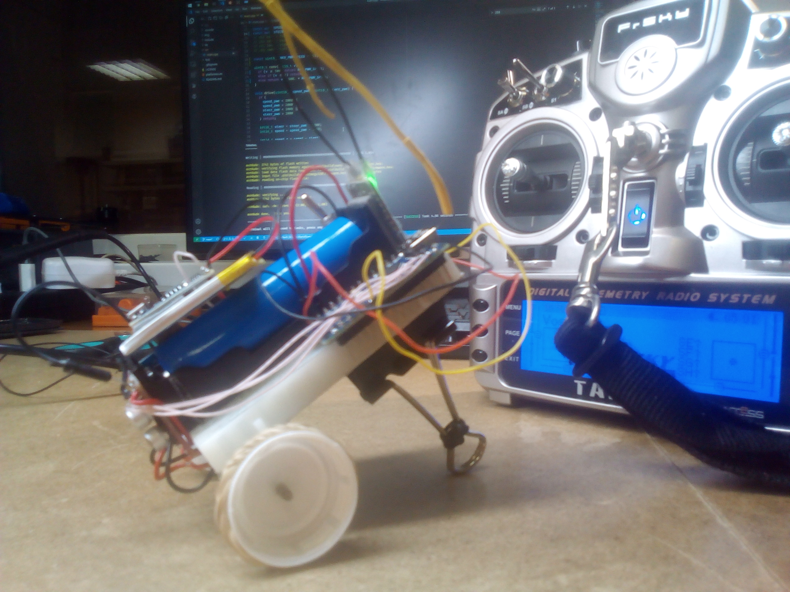
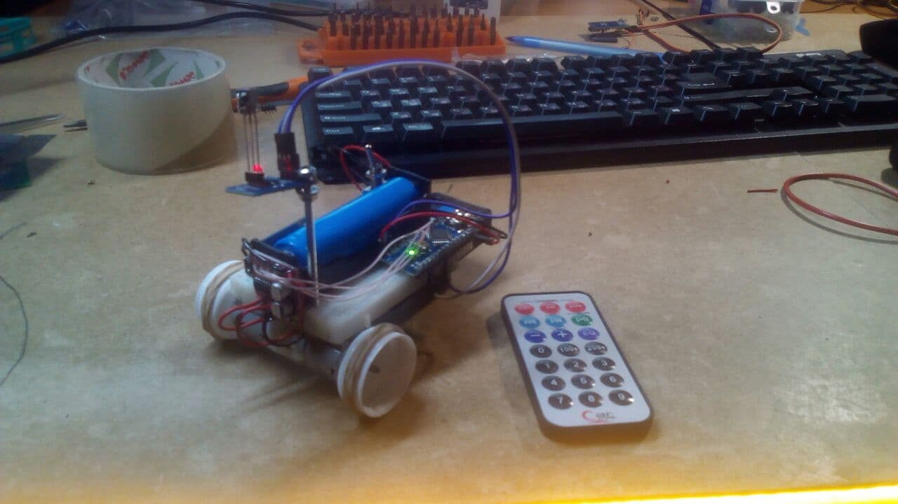
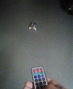

# ArduinoNanoRover

## Version 2.5 [ RC + separate batteries ]

## References

Get data from RC:

https://github.com/dimag0g/PPM-reader

Write data to motors:

https://www.instructables.com/Tutorial-for-Dual-Channel-DC-Motor-Driver-Board-PW/

## Version 1  [ IR ]

